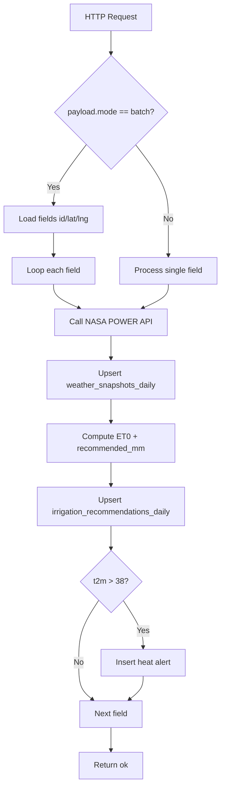
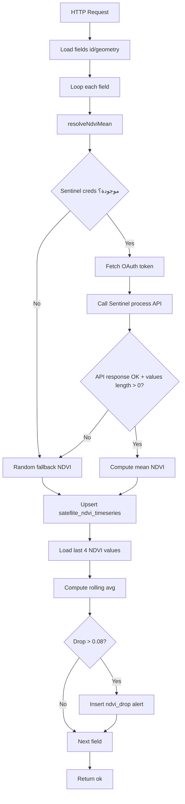
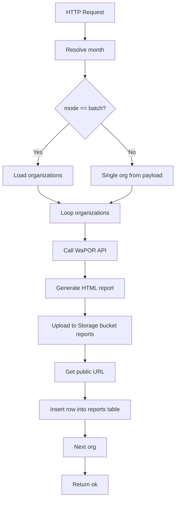
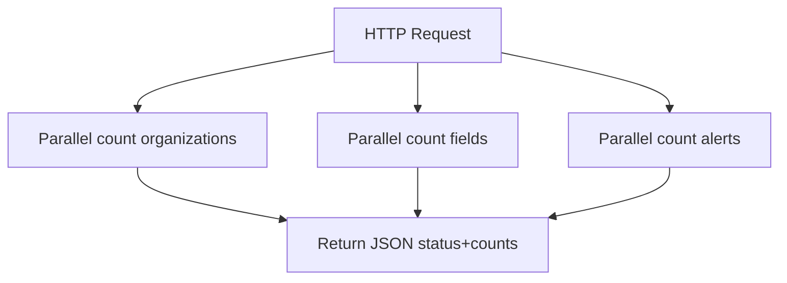

# DATA PIPELINE RELIABILITY

هذا المستند يصف موثوقية خطوط البيانات (Data Pipelines) المبنية عبر Edge Functions في `supabase/functions/*`، مع خرائط التدفق، سياسات retry/backoff، قواعد idempotency، fallback، وسيناريوهات الفشل والاسترداد.

## 1) خرائط التدفق لكل وظيفة (Flow Maps)

### 1.1 `fetch-weather-daily`

**نقاط حرجة:**
- اعتماد خارجي على NASA POWER.
- الاعتماد على إحداثيات صالحة (`lat/lng`).
- الكتابة على جدولين رئيسيين + جدول تنبيهات.

### 1.2 `fetch-ndvi`

**نقاط حرجة:**
- اعتماد خارجي على Sentinel Hub (OAuth + Process API).
- fallback الحالي يعتمد قيمة عشوائية، ما يؤثر على الثبات التحليلي.

### 1.3 `generate-report-monthly`

**نقاط حرجة:**
- اعتماد خارجي على WaPOR API.
- اعتماد داخلي على Storage upload + DB insert دون transaction عبر النظامين.

### 1.4 `system-health`

**نقاط حرجة:**
- فشل قراءة أي جدول قد يسبب استجابة غير مكتملة أو فشل endpoint.

---

## 2) سياسات Retry/Backoff

> ملاحظة: الكود الحالي لا يطبق retries صريحة. السياسات أدناه هي baseline تشغيلية موصى بها لتوحيد السلوك.

### 2.1 تصنيف العمليات
- **External API calls**: NASA POWER / Sentinel / WaPOR.
- **Supabase writes**: `upsert`/`insert` على Postgres وStorage.
- **Supabase reads**: استعلامات عدّ أو تحميل كيانات.

### 2.2 سياسة retry الموصى بها
- **External API (GET/POST)**
  - `maxAttempts = 4` (1 + 3 retries).
  - Backoff: exponential + jitter.
  - تأخيرات إرشادية: `500ms`, `1500ms`, `3500ms` مع jitter ±20%.
  - retry فقط على:
    - أخطاء الشبكة (timeout/reset).
    - HTTP `429`, `502`, `503`, `504`.
  - **لا تعيد المحاولة** على HTTP `400/401/403/404` إلا بعد تصحيح المدخلات/الأسرار.

- **Supabase writes**
  - `maxAttempts = 3`.
  - Backoff: `250ms`, `1000ms` + jitter.
  - retry على أخطاء transient المعروفة (connectivity/pool saturation).
  - لا retry عند أخطاء قيود البيانات (schema/constraint violations) إلا بعد معالجة السبب.

- **Batch loop strategy**
  - `continue-on-error`: فشل عنصر لا يوقف كامل الدفعة.
  - تجميع نتائج التنفيذ: `processed/succeeded/failed` مع قائمة معرفات الفشل.

### 2.3 timeout standards
- NASA/WaPOR: timeout 12s.
- Sentinel token/process: timeout 15s لكل نداء.
- Storage upload: timeout 10s.

---

## 3) قواعد Idempotency

### 3.1 قواعد مطبقة حالياً
- `weather_snapshots_daily`: upsert على `(field_id, date)`.
- `irrigation_recommendations_daily`: upsert على `(field_id, date)`.
- `satellite_ndvi_timeseries`: upsert على `(field_id, date)`.

هذا يضمن عدم تكرار السجلات عند إعادة تشغيل نفس اليوم/الحقل.

### 3.2 قواعد مطلوبة للتنبيهات (alerts)
لأن التنبيهات تستخدم `insert` مباشر، يجب منع الازدواجية عبر واحد من:
1. **Unique index**: `(field_id, date, type)`.
2. أو استخدام `upsert` بدل `insert` لنفس المفتاح المنطقي.

### 3.3 قواعد مطلوبة للتقارير الشهرية
سجل `reports` يتم بـ `insert` فقط. يوصى بـ:
- مفتاح فريد `(org_id, month, type)`.
- التحويل إلى upsert أو pre-check قبل insert.

### 3.4 idempotency key تشغيلي
لكل job batch:
- `job_key = <function_name>:<date_or_month>`.
- تخزين حالة التنفيذ (`running/succeeded/failed`) في جدول تشغيل (مثل `pipeline_runs`) لتجنب تشغيل مكرر متزامن.

---

## 4) قواعد Fallback عند فشل API خارجي

### 4.1 `fetch-weather-daily`
- عند فشل NASA:
  1. استخدم آخر snapshot متاح لنفس الحقل (<= 3 أيام).
  2. إن لم يوجد، استخدم baseline افتراضي محافظ (`T2M=30, WS2M=2, RH2M=40`) مع `confidence` منخفض.
  3. سجّل event تنبيهي من نوع `external_api_degraded`.

### 4.2 `fetch-ndvi`
- السلوك الحالي fallback عشوائي؛ يوصى باستبداله بـ:
  1. آخر NDVI صالح خلال آخر 14 يوم.
  2. إن لم يوجد، median على مستوى المزرعة/المنطقة.
  3. إن لم يتوفر، قيمة fallback ثابتة (مثل 0.42) **وليس عشوائية**.
- وسم القياس `source=fallback` لتمييزه عن القياس الحقيقي.

### 4.3 `generate-report-monthly`
- إذا فشل WaPOR:
  1. أنشئ تقرير placeholder بالحالة `partial`.
  2. استمر في رفع التقرير ووسم `payload.source_status = degraded`.
  3. أعد جدولة محاولة تحديث enrichment لاحقة (async repair job).

### 4.4 مبادئ عامة
- fallback يجب أن يكون **deterministic** وقابلاً للتتبع.
- أي fallback يهبط تلقائياً بدرجة `confidence` ويُسجل سبب الهبوط.

---

## 5) حالات الفشل المتوقعة وكيفية الاسترداد

| Failure Mode | Detection | Recovery Action |
|---|---|---|
| NASA API timeout/5xx | HTTP code + timeout metric | Retry exponential، ثم fallback من آخر snapshot، ثم وسم confidence منخفض |
| Sentinel OAuth فشل | token endpoint non-200 | Retry محدود، تحقق من الأسرار، fallback NDVI غير عشوائي |
| Sentinel Process يعيد بيانات فارغة | `values.length == 0` | استخدام آخر NDVI صالح + تسجيل سبب `empty_satellite_response` |
| WaPOR غير متاح | request error/5xx | إنشاء تقرير partial + جدولة repair job |
| Supabase upsert transient error | exception / network reset | Retry حتى 3 محاولات مع jitter |
| خطأ قيود DB (constraint) | Postgres error code | لا retry؛ صحح schema/key أو البيانات ثم أعد التشغيل |
| تكرار alerts لنفس اليوم | زيادة غير طبيعية بعد re-run | فرض unique key `(field_id,date,type)` أو upsert |
| انقطاع أثناء batch loop | mismatch بين processed والمتوقع | تشغيل re-run idempotent على العناصر الفاشلة فقط |
| مدخلات ناقصة (`lat/lng/geometry`) | validation failure قبل API call | تخطي العنصر + تسجيل data-quality issue + إخطار فريق البيانات |
| فشل رفع التقرير إلى Storage | storage upload error | Retry، وإن استمر الفشل: وضع report status=`failed_upload` وإعادة المحاولة لاحقاً |

---

## 6) قابلية المراقبة (Observability) المقترحة

- لكل تنفيذ function، أرجع:
  - `processed`, `succeeded`, `failed`, `fallback_used`.
- سجّل structured logs تتضمن:
  - `function_name`, `entity_id`, `date/month`, `attempt`, `error_class`, `fallback_applied`.
- إنشاء تنبيه تشغيلي إذا:
  - نسبة الفشل > 5% في batch واحدة.
  - نسبة fallback > 20% خلال 24 ساعة.

---

## 7) Runbook مختصر لإعادة التشغيل

1. حدد window المتأثر (`date` أو `month`).
2. استخرج قائمة العناصر الفاشلة من السجلات.
3. أعد التشغيل بنفس payload (idempotent keys تمنع التكرار).
4. راقب تراجع معدل الفشل وfallback.
5. إن استمر الفشل الخارجي، فعّل degraded mode وأصدر تنبيه عمليات.
